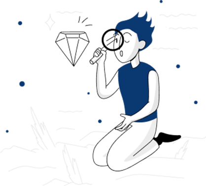

# Encriptador de texto

Este proyecto se realizó, en base al challenge final del curso de Lógica de Programación, impartido por Alura Latam, a través del programa One de Oracle.


## Insignias


## Índice
* [Título e imagen de portada](#encriptador-de-texto)
* [Insignias](#insignias)
* [Índice](#índice)
* [Descripción del proyecto](#descripción-del-proyecto)
* [Estado del proyecto](#estado-del-proyecto)
* [Características de la aplicación y demostración](#características-de-la-aplicación-y-demostración)
* [Tecnologías utilizadas](#tecnologías-utilizadas)
* [Demostración del Funcionamiento](#demostración-del-funcionamiento)
* [Personas-Desarrolladores del Proyecto](#personas-desarrolladores)
* [Licencia](#licencia)
* [Conclusión](#conclusión)
* [Code Blocks (multi-language) & highlighting](#code-blocks-multi-language--highlighting)

## Descripción del proyecto
Este proyecto consiste en un encriptador de texto desarrollado como parte del challenge final, del curso de Lógica de Programación de Alura Latam, como parte del programa One de Oracle. El objetivo era crear una aplicación web que permitiese encriptar y desencriptar un texto, utilizando ciertas reglas de sustitución de caracteres.

## Estado del proyecto
Terminado

## Características de la aplicación y demostración
### Instrucciones del desafío:
1. Nos brindaron un diseño modelo como guia a seguir, a traves de la plataforma [Figma](https://www.figma.com/design/trP3p5nEh7XUyB3n2bomjP/Alura-Challenge---Desaf%C3%ADo-1---L%C3%B3gica?node-id=0-1&t=oLMQWoS3F8QEu6ya-0), para darle estructura visual a nuestro encriptador.

2. De la misma forma, nos entregaron las directrices de la lógica de encriptación de nuestro programa, a través de [Trello](https://trello.com/c/gNl1c9sg/12-sobre-el-desaf%C3%ADo).

3. Directrices:
#### Las "llaves" de encriptación utilizadas son las siguientes:
- La letra "e" es convertida para "enter"
- La letra "i" es convertida para "imes"
- La letra "a" es convertida para "ai"
- La letra "o" es convertida para "ober"
- La letra "u" es convertida para "ufat"

#### Requisitos:
- Debe funcionar solo con letras minúsculas.
- No deben ser utilizadas letras con acentos ni caracteres especiales.
- Debe ser posible convertir una palabra para la versión encriptada también devolver una palabra encriptada para su versión original.

Por ejemplo:
- "gato" => "gaitober"
- "gaitober" => "gato"

#### La página debe tener campos para:
- Inserción del texto que será encriptado o desencriptado, y el usuario debe poder escoger entre las dos opciones.
- El resultado debe ser mostrado en la pantalla.

#### Extras:
- Un botón que copie el texto encriptado/desencriptado para la sección de transferencia, o sea, que tenga la misma funcionalidad del ctrl+C o de la opción "copiar" del menú de las aplicaciones.

## Tecnologías utilizadas
- HTML
- CSS (Grid, Flexbox, Media Queries)
- JavaScript

## Demostración del Funcionamiento

En esta sección se muestra una demostración del funcionamiento del encriptador de texto. A continuación se muestran capturas de pantalla que ilustran el proceso de encriptación, copiado de texto y desencriptación.

1. Texto encriptado

- En esta imagen se muestra el texto encriptado utilizando el encriptador.

2. Botón de copiar texto funcionando

- Aquí se observa el funcionamiento del botón de copiar texto, que permite copiar el texto encriptado/desencriptado al portapapeles.

3. Texto desencriptado

- Esta imagen muestra el resultado del texto desencriptado luego de aplicar la funcionalidad correspondiente.

## Personas-Desarrolladores del Proyecto
- Héctor Andrés González Mora - [GitHub](https://github.com/hectorgm26)

## Licencia
Este proyecto está bajo la licencia MIT.

## Conclusión
Este proyecto fue una excelente oportunidad para aplicar conocimientos en lógica de programación y diseño web responsivo. La implementación de las reglas de encriptación y desencriptación proporcionadas fue un desafío interesante que mejoró mis habilidades en JavaScript.

## Code Blocks (multi-language) & highlighting

### HTML code

```html
<!DOCTYPE html>
<html lang="es">
<head>
  <meta charset="UTF-8">
  <meta name="viewport" content="width=device-width, initial-scale=1.0">
  <meta name="description" content="Encriptador de texto para challenge de Alura One Oracle">
  <meta name="robots" content="index, follow">
  <title>Encriptador de texto Alura ONE</title>
  <link rel="stylesheet" type="text/css" href="css/styles.css">
</head>

<body>

  <div class="container-fluid">
        <header class="header">
            
            <h2 class="header-title"><strong>Encriptador de texto - Challenge Alura</strong></h2>
        </header>

        <main class="contenido">
            <label for="texto"><h1><strong><em>Ingrese el texto aquí:</em></strong></h1></label>
            <br>
            <br>
            <div class="container-texto">
              <textarea id="texto" class="texto-a-convertir" name="texto-a-convertir" rows="10" cols="120" required placeholder="Ingrese el texto aquí..."></textarea>
            </div>


        </main>

        <aside class="siderbar-salida-texto">
          <h3>Texto transformado:</h3>
          <div class="texto-placeholder">
              
              <p class="placeholder-text">Ingresa el texto que desees encriptar o desencriptar</p>
          </div>
          <textarea class="texto-convertido" name="texto-convertido" rows="15" cols="60" required></textarea>
          <br>
          <div class="boton-copiar">
              <button onclick="copiarTexto()">Copiar texto</button>
          </div>
        </aside>


        <div class="widget-1">
          <button onclick="encriptarTexto()">Encriptar</button>

        </div>

        <div class="widget-2">
          <button onclick="desencriptarTexto()">Desencriptar</button>

        </div>

        <footer class="footer">
          <p> Advertencia: Solo ingresar letras minúsculas y sin acentos</p>
          <br>
          <h4>Copyright © Desarrollado por Héctor Andrés González Mora, 2024</h4>
        </footer>


  </div>

</body>
<script src="js/app.js"></script>
</html>
```

### CSS code

```css
@import url('https://fonts.googleapis.com/css2?family=Krona+One&display=swap');

* {
  margin: 0;
  padding: 0;
  box-sizing: border-box;
}

body {
  background: #FFF5E1;
  color:#000;
  font-family: "Krona One", sans-serif;
}

.container-fluid {
  width: 90%;
  max-width: 1500px;
  margin: 20px auto;
  display: grid;
  grid-gap: 20px;
  grid-template-columns: repeat(3, 1fr);
  grid-template-rows: repeat(4, auto);

  grid-template-areas: "header header header"
                       "contenido contenido sidebar-salida-texto"
                       "widget-1 widget-2 sidebar-salida-texto"
                       "footer footer footer";
}

.container-fluid > div,
.container-fluid .header,
.container-fluid .contenido,
.container-fluid .siderbar-salida-texto,
.container-fluid .footer {

  background: #E1F7F5;
  padding: 20px;
  border-radius: 4px;

}

.container-fluid .header {
  background: #0C1844;
  color: white;
  grid-area: header;
  text-align: center;
  border-radius: 30px;
  border: solid black;
  display: flex;
  align-items: center;
  position: relative;
  padding: 10px;
}

.header .logo {
  position: absolute;
  left: 15px;
  width: 25px;
}

.header-title {
  flex: 1;
  text-align: center;
  margin: 0;
}

.container-fluid .contenido {
  background: #FFF5E1;
  grid-area: contenido;
}

.container-fluid .siderbar-salida-texto {
  grid-area: sidebar-salida-texto;
  background: #FF6969;
  text-align: center;
  display: flex;
  flex-direction: column;
  align-items: center;
  justify-content: flex-start;
  min-height: 200px;
  border-radius: 30px;
  border: solid;
  height: auto;
}

.siderbar-salida-texto h3 {
  margin-bottom: 20px;
}

.container-fluid .siderbar-salida-texto .boton-copiar button {
  padding: 10px 20px;
  font-size: 16px;
  color: white;
  background-color: #0C1844;
  border: solid black;
  border-radius: 10px;
  cursor: pointer;
  transition: background-color 0.3s ease;
  width: 100%;
  max-width: 200px;
  font-family: "Krona One", sans-serif;
}

.texto-placeholder {
  display: flex;
  flex-direction: column;
  align-items: center;
  justify-content: center;
  height: 100%;
}

.placeholder-image {
  max-width: 80%;
  height: auto;
  margin-bottom: 20px;
}

.placeholder-text {
  text-align: center;
  font-size: 16px;
  color: #666;
}

.texto-convertido {
  display: none;
}

.container-fluid .widget-1,
.container-fluid .widget-2 {
  background: #C80036;
  height: 30px;
  border-radius: 40px;
  border: solid;
  text-align: center;
  display: flex;
  align-items: center;
  justify-content: center;
  position: relative;

}

.container-fluid .widget-1 {
  grid-area: widget-1;

}

.container-fluid .widget-2 {
  grid-area: widget-2;

}

.container-fluid .widget-1 button,
.container-fluid .widget-2 button {
  padding: 10px 20px;
  font-size: 16px;
  color: white;
  background-color: #C80036;
  border: none;
  border-radius: 40px;
  cursor: pointer;
  transition: background-color 0.3s ease;
  width: 100%;
  height: 100%;
  position: absolute;
  top: 0;
  left: 0;
  font-family: "Krona One", sans-serif;
}

.container-fluid .widget-2 button {
  background-color: #028391;
}

.container-fluid .widget-1:hover button,
.container-fluid .widget-2:hover button {
  background-color: #12203E;
}


.container-fluid .footer {
  background: #0C1844;
  color: white;
  grid-area: footer;
  border-radius: 30px;
  border: solid black;

}

.footer img {
  width: 30px;
  margin-right: 1px;
  vertical-align: middle;
}

.container-texto {
  width: 100%;
}

.texto-a-convertir {
  width: 100%;
  max-width: 100%;
  box-sizing: border-box;
}

h4 {
  text-align: end;
}

.texto-convertido {
  width: 100%;
    max-width: 100%;
    box-sizing: border-box;
    min-height: 150px;
    resize: vertical;
    flex-grow: 1;
}

textarea {
  font-size: 17px !important;
  border-radius: 5px;
  border: solid;
}

/* MEDIA QUERY PARA EL SIDEBAR */
@media screen and (max-width: 1024px) {
  .container-fluid .siderbar-salida-texto {
    min-height: auto;
  }
}

/* MEDIA QUERY PARA TABLETS */
@media only screen and (min-device-width: 768px) and (max-device-width: 1024px) {
  .container-fluid {
    display: grid;
    grid-template-columns: 1fr 1fr;
    grid-template-areas: 
      "header header"
      "contenido contenido"
      "widget-1 widget-2"
      "sidebar-salida-texto sidebar-salida-texto"
      "footer footer";
    text-align: center;
  }
  
  h4 {
    text-align: center;
  }
}

/* MEDIA QUERY PARA SMARTPHONES */
@media screen and (max-width: 768px) {
  .container-fluid {
    display: grid;
    grid-template-columns: 1fr;
    grid-template-areas: 
      "header"
      "contenido"
      "widget-1"
      "widget-2"
      "sidebar-salida-texto"
      "footer";
    text-align: center;
  }
  
  h4 {
    text-align: center;
  }

  .container-fluid .header {
    display: flex;
    flex-direction: column;
    align-items: center;
    height: auto;
  }

  .header .logo {
    position: relative;
    left: 0;
    margin-bottom: 10px;
  }

  .header-title {
    text-align: center;
  }
}
```

### Javascript　

```javascript
// Función para encriptar el texto
function encriptarTexto() {
  const textoOriginal = document.getElementById('texto').value.toLowerCase();
  let textoEncriptado = textoOriginal
      .replace(/e/g, "enter")
      .replace(/i/g, "imes")
      .replace(/a/g, "ai")
      .replace(/o/g, "ober")
      .replace(/u/g, "ufat");
  
  mostrarTextoConvertido(textoEncriptado);
}

// Función para desencriptar el texto
function desencriptarTexto() {
  const textoEncriptado = document.getElementById('texto').value.toLowerCase();
  let textoDesencriptado = textoEncriptado
      .replace(/enter/g, "e")
      .replace(/imes/g, "i")
      .replace(/ai/g, "a")
      .replace(/ober/g, "o")
      .replace(/ufat/g, "u");
  
  mostrarTextoConvertido(textoDesencriptado);
}

// Función para mostrar el texto convertido
function mostrarTextoConvertido(texto) {
  const placeholder = document.querySelector('.texto-placeholder');
  const textoConvertido = document.querySelector('.texto-convertido');
  
  if (texto) {
      placeholder.style.display = 'none';
      textoConvertido.style.display = 'block';
      textoConvertido.value = texto;
  } else {
      placeholder.style.display = 'flex';
      textoConvertido.style.display = 'none';
      textoConvertido.value = '';
  }
}

// Función para copiar el texto convertido
function copiarTexto() {
  const textoConvertido = document.querySelector('.texto-convertido');
  textoConvertido.select();
  document.execCommand('copy');
  alert('Texto copiado al portapapeles');
}

// Se llama a la funcion al cargar al inicio la página
window.onload = function() {
  mostrarTextoConvertido('');
}
```
